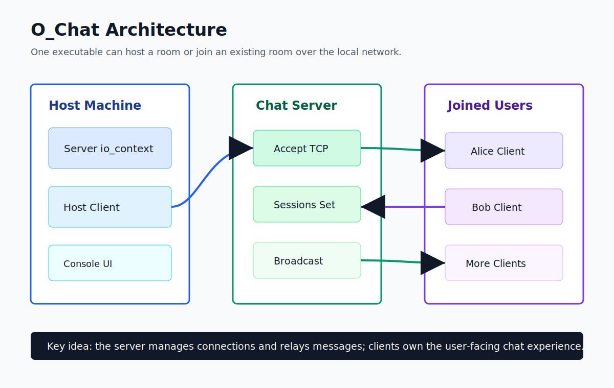
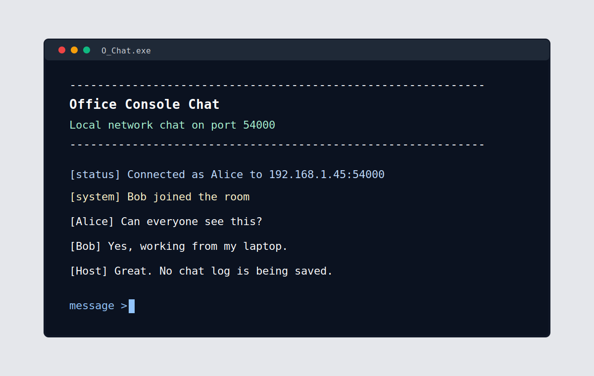
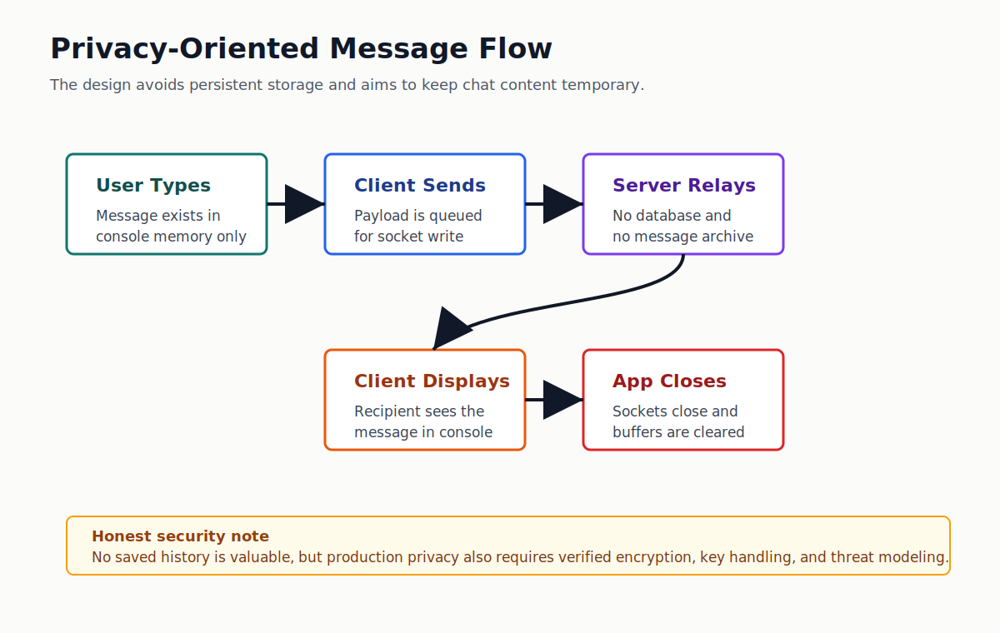

# O_Chat: A Small Office Chat App I Built in C++

I built O_Chat because I wanted a simple office chat tool that did not depend on a cloud account, a database, or a permanent message history. The idea was basic: one person starts a room on the local network, other people join using the host IP, and the chat disappears when the program closes.

It is still a prototype, but it turned into a useful C++ networking project. I had to make the server accept multiple clients, keep sessions alive, relay messages, clean up on exit, and make the console experience readable enough that someone could actually use it.

## What It Does

- Runs as one executable with two modes: host or join.
- Lets multiple people connect to the same host over the LAN.
- Relays messages in real time using TCP sockets.
- Shows join/leave notices and username-prefixed chat messages.
- Keeps chat data temporary. There is no database and no saved chat log.
- Uses `/quit` for a normal exit.
- Includes a first pass at shared room-key encryption for message payloads.

## What I Started With

The project had the shape of an app, but not the behavior yet. There were headers for `Client`, `Server`, and `Session`, plus a `main.cpp`, but the important `.cpp` files were basically empty.

So the first real job was not polishing. It was getting the boring-but-important path working:

1. Start a server.
2. Accept a TCP client.
3. Read a username.
4. Read messages line by line.
5. Broadcast each message to the other sessions.
6. Keep the app alive without blocking the network loop.

That last part mattered more than I expected.

## The Architecture

The app is split into a few small pieces:

- `main.cpp` asks whether to host or join, starts the network loops, and handles shutdown.
- `Server` owns the acceptor and the active sessions.
- `Session` represents one connected user on the server side.
- `Client` connects to the host, sends typed messages, and displays messages received from the room.
- `ConsoleUi` keeps the terminal output consistent.
- `Crypto` is the first pass at encrypting message payloads with a shared room key.

## Bugs and Decisions That Made It Real

### The host was not really ready when the client connected

Host mode is a little tricky because the host also joins the room as a client. My first version created the server and then immediately tried to connect the host client to it. The problem was that the ASIO event loop was not running yet, so the acceptor was not actually doing useful work.

The fix was to split the host into separate server and client `io_context` loops. The server loop starts first, then the host client connects to `127.0.0.1`.

### Port 54000 broke because I used the wrong type

This was the most satisfying bug because it looked like a networking problem but was really a type problem. I stored port `54000` in a signed `short`. That overflowed and showed up as a negative port value.

Changing the port to `std::uint16_t` fixed it. Small bug, big lesson: networking code punishes casual types.

### Console output became messy once messages arrived asynchronously

When incoming messages arrive while a user is typing, terminal output can get ugly fast. I added a small `ConsoleUi` helper with consistent prompts and a mutex around output. It is not a full terminal UI, but it made the app feel much less rough.

## Privacy Choices

My privacy goal was simple: do not keep chat history after closing the executable.

So the app avoids:

- database storage
- chat log files
- server-side message history
- replaying old messages when someone joins

Messages live in memory while the program is running. On normal shutdown, sockets close, queues are cleared, and the console is cleared.

I also added a shared room-key encryption path so the server can relay encrypted payloads instead of needing to understand message text. I am being careful with how I describe that: it is a direction toward stronger privacy, not something I would call production-grade security yet.

## What I Would Improve Next

If I continue this project, these are the next things I would do:

- Finish automated verification for encrypted multi-client chat.
- Add graceful Ctrl+C handling.
- Show the host machine's LAN IP automatically.
- Add better error messages for firewall/port issues.
- Replace the custom crypto experiment with TLS or a reviewed library before claiming strong security.
- Add a simple test harness that starts two or three clients and proves message delivery.

## Is It Portfolio-Worthy?

Yes, but only if I present it honestly.

I would not call this a finished secure messenger. That would be too much. I would call it:

> A privacy-oriented local office chat prototype built in C++ with ASIO, supporting host/join mode, multiple users, async TCP relay, no persistent chat history, and a readable console UX.

That framing feels accurate. It shows systems programming, networking, debugging, and product thinking without pretending the prototype is more mature than it is.

## What I Learned

This project reminded me that "working" is not one thing. The app had to compile, connect, keep clients alive, display messages clearly, exit cleanly, and match the privacy goal.

The biggest takeaway was that privacy is not just a feature label. Even for a small LAN chat app, it forces decisions about storage, logs, memory, transport, shutdown, and what claims are fair to make.
